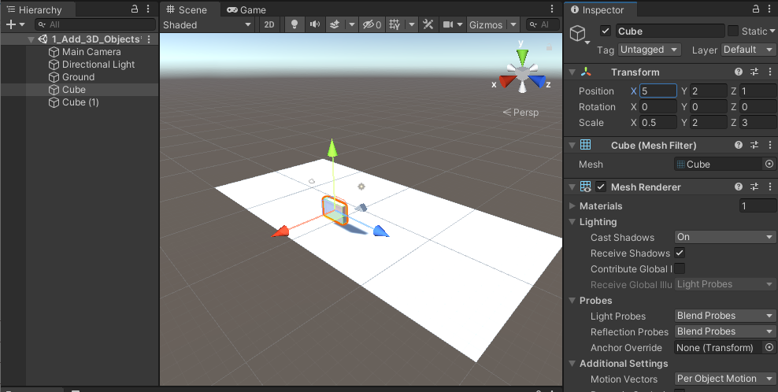

# Manipulate 3D Objects on a scene

## Tasks
1. Create a new 3D scene and rename it `Task_1_1`
1. Add a plane at (0,0,0) (x,y,z)
1. Rescale the plane to x=2, z=4
1. Rename the plane to `Ground`
1. Add a cube to the scene at (5,2,1) with a scale of (0.5,2,3)
1. Add a second cube to thee scene at (0,0,0) that is rotate 45 degrees around the x axis and 15 degrees around the z axis

## Reference Images
