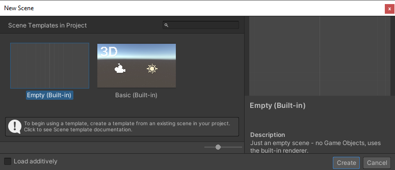
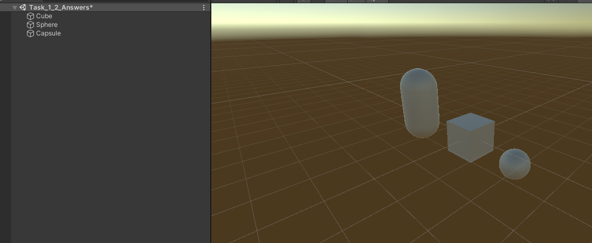
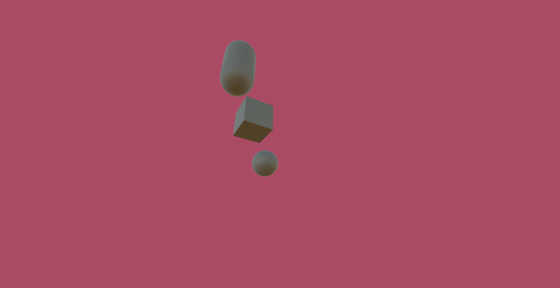

# Camera Movement and Manipulation

## Tasks

1. Create a new blank scene.
1. Add a cube at (0,0,0)
1. Add a sphere at (-1,-1,1)
1. Add a capsule at (1,1,-1)
1. Rescale the plane to x=2, z=4
1. Add a camera with the following transform properties:
    - Position (5,-4,-2)
    - Rotation x=-30, y=300, z=0
1. Change the Skybox to a solid colour with the RGB values of R=170,G=75, B=100 (Hex=AA4B64). Set the alpha to 0
1. Set the field of view to 75

## Reference Images

