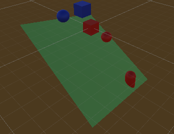
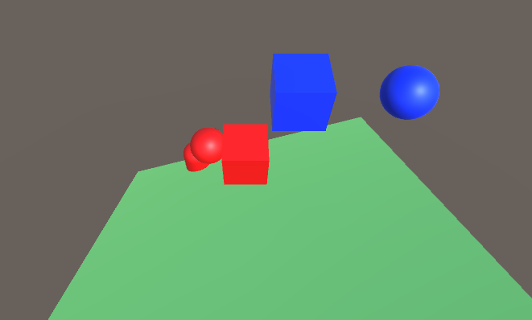
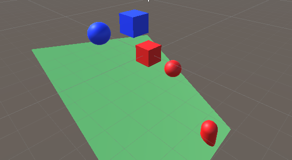

# Add Components to an object

## Tasks

1. Open the scene `Task_1_3`
1. Create a material with a blue colour, save it as PhysicsMaterial.
1. Apply this material to the `CubePhysics` and `SpherePhysics`
1. Add a Directional light GameObject to the scene.
1. Position the light so that it highlights the scene
1. Add a `Rigidbody` to the `CubePhysics` and `SpherePhysics` objects.
1. Press the `Play` button to test your scene.
1. Change the `Sphere Collider` on `SpherePhysics` so that it has a radius of 1 and a centre of (0,0.5,0)`CubePhysics` and `SpherePhysics`
1. Change the mass of `SpherePhysics` to 0.01
1. Add a Rigidbody to the Capsule on the scene and change its material to the one you created.

## Reference Images

