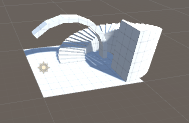

# Package Manager: Installing Packages

## Tasks

1. Create a new scene called `Task_1_5`
1. Install the Probuilder package using Package Manager
1. Install the Input System package, restart Unity when asked.
1. Use ProBuilder to add objects to the scene as, an example is shown in the reference images.
1. Add a capsule object for a player to the scene. Name this object `Player`
1. Add a custom material to the player
1. Add a `PlayerInput` component to the player
1. Create `DefaultInputActions` and attach these to the PlayerInput component.
1. **Note that the player will not move**
1. Add the [Food Asset Pack](https://assetstore.unity.com/packages/3d/food-pack-3d-microgames-add-ons-163295) from the Unity Store to your account
1. Import ***only*** the `Watermelon` asset.
1. Move the asset to the `5_Install_Package` folder
1. Add the watermelon to your scene, position and scale appropriately.

## Reference Images

