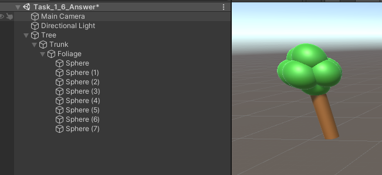
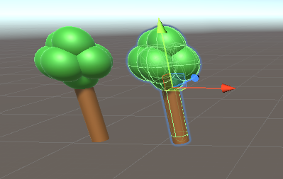

# Nested GameObjects

## Tasks

1. Create a new Scene
1. Add an empty GameObject, name this Tree.
1. Add GameObjects to this to create an object that looks like a tree.
    1. Add a Cylinder with a scale of 2 to the y axis, name this `Trunk`.
    1. Add another empty GameObject called `Foliage`
    1. Reposition Foliage to the top of the `Trunk`
1. Create and apply appropriate materials to the trunk and spheres of the foliage.
1. Duplicate the tree and place it alongside the existing tree

## Reference Images

