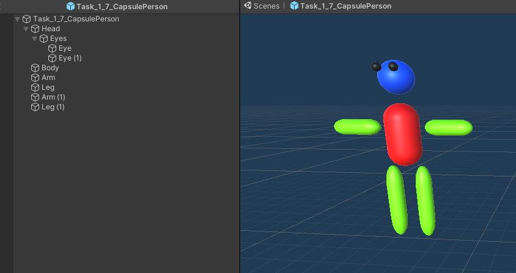
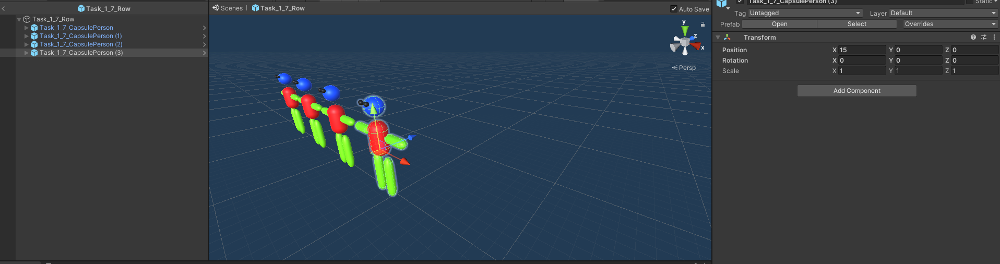
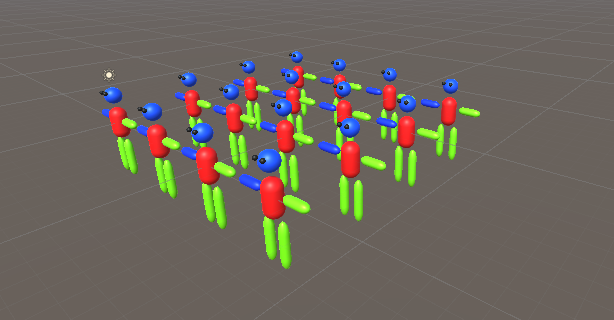

# Using Prefabs

## Tasks

1. Open the scene `Task_1_7`
1. Convert the `CapsulePerson` object into a prefab
1. Name the prefab appropriately
1. Open the prefab
1. Add the `LimbMaterial` to each limb and the `HeadMaterial` to the head of the person
1. Delete the original Prefab / Person from the scene.
1. Create an empty `GameObject` named `Row`
1. Position at (0,0,0)
1. Convert this to a new Prefab
1. Open the prefab row
1. Add the `CapsulePerson` prefab at (0,0,0) of the `Row` prefab.
1. Add three extra copies of the prefab as shown below at x=5, x=10, and x=15.
1. Go back to the Scene
1. Add multiple rows of people behind each other.
1. Open the person prefab and change one arm to a different colour

## Reference Images

