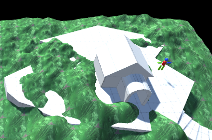

# Build A Level

## Tasks

1. Using all of your previous skills build a 3D level / environment.
1. Your level must contain the following Unity features:
    - Terrain
    - Prefabs
    - Materials / Textures
    - Lighting
    - Some form of physics using Rigidbody components
1. You should have at least one building and a person or animal in your scene.

## Reference Images
