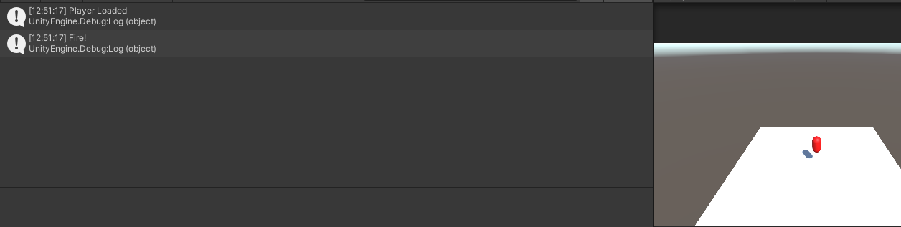

# Moving the Player: Input System Package and CharacterController

## Tasks
1. Import the `Input System` package using the package manager.
1. Open the Scene `Task_2_8`.
2. Add a `CharacterController` component to the `Player` object
3. Add a script named `PlayerMovement`
4. Attach the script to the `Player` object
5. In the stard method write the message `Player Loaded` to Debug.Log
6. Add the `PlayerInput` component and input actions ot the player.
7. Write code to move the player using `WASD` and a `Controller`.
8. Add code so that when a button is pressed a Debug.Log message `Fire!` is displayed

## Reference Images

