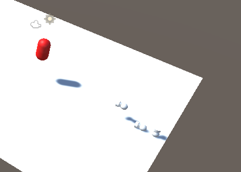

# Instantiating (Creating) Objects through code

You need to be able to write code that can detect a button press to complete this task.

This task builds on from [`Task_2_1`](../1_Moving_Player/Task_2_1.md)

## Tasks
1. Open the scene `Task_2_2`. The `PlayerInput` components and input actions have already been added for you. You have also been provided with the prefab for the bullet.
2. Create a script called `PlayerShoot`
3. Attach the script to the player
4. Add code to the player so that when the `Fire` button is pressed the prefab `Task_2_2_BulletPrefab` will be instantiated (created) in front of the player object.
5. Add code to move the instantiated prefab forward in the direction of the player.

## Reference Images

