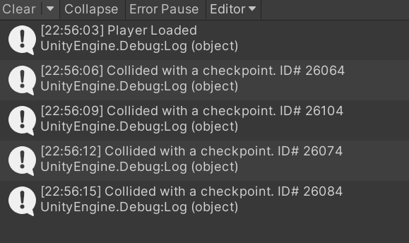
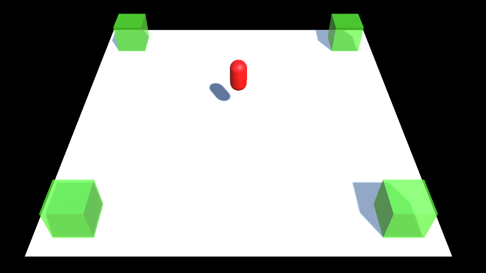

# Instantiating (Creating) Objects through code

You need to be able to write code that can move a player object around on the scene.

This task builds on from [`Task_2_1`](../1_Moving_Player/Task_2_1.md)

## Tasks
1. Open the scene `Task_2_3`. The `PlayerInput` components and input actions have already been added for you.
2. Create a tag called `Checkpoint` and attach this to the cubes in each corner
3. Create a script called `PlayerCollision`
4. Attach the script to the player
5. Write code to display a Debug.Log message when each collider has been entered (collided with / triggered).
6. Add code so that the object is destroyed when the trigger is activated.
7. **Extension**: Modify the code so that the colour of the cube is changed randomly when the trigger has been run

## Reference Images

