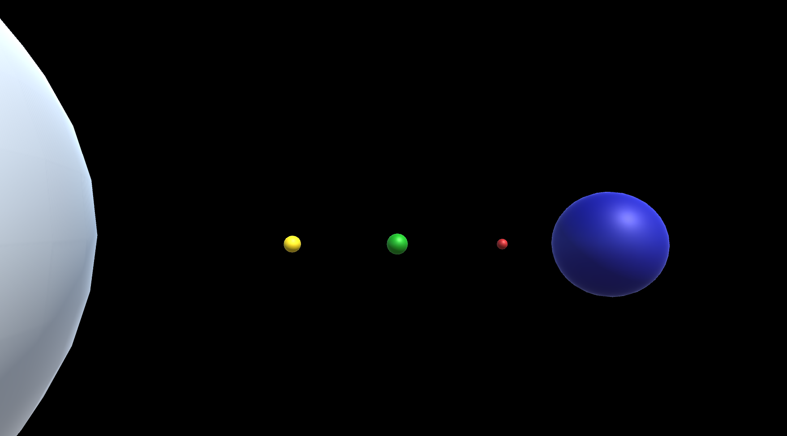

# Destroying Objects After A Set Time

## Tasks
1. Open the scene `Task_2_4`. The `Task_2_4_EaterOfWorlds` script has been attached to each object on the scene.
2. Modify the script so that you can destroy each object after a set amount of time.
3. You need to pass a value to a variable in the script that will determine how long the object will stay alive for before it is destroyed. e.g. A value of 1 will see the object remain alive for 1 second.
4. Venus should disappear after one second, Earth after two, Mars after three, and Neptune after five seconds.
5. **Extension**: After 5 seconds the Sun should change colour to Magenta and after 10 seconds the Sun should be destroyed as well as the light.

## Reference Images
