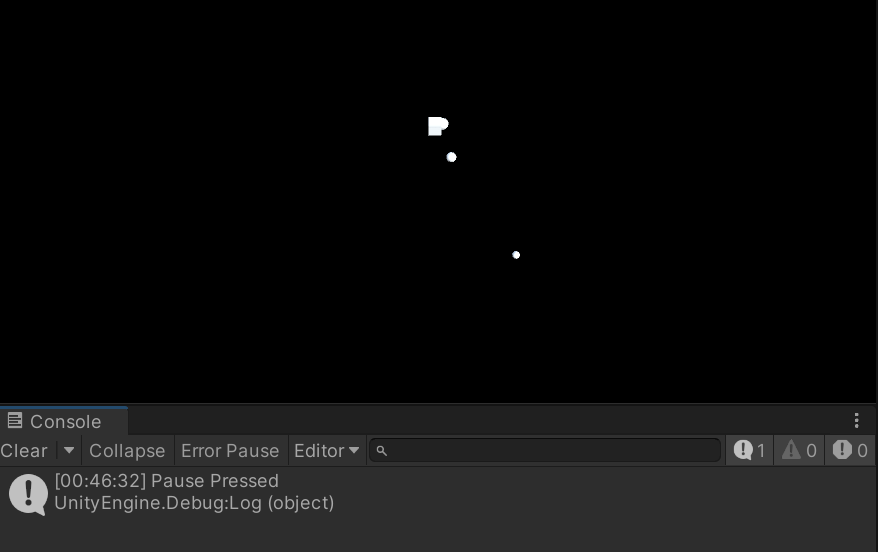

# Pausing the Game

## Tasks
1. Open the scene `Task_2_5`. There is an object spawner that will create objects every second.
2. Your tasks is to add code that when the pause key `Escape` is pressed or the `Select` button on a controller / gamepad the game will pause.
3. When the button is pressed again the game should restart.

## Reference Images
