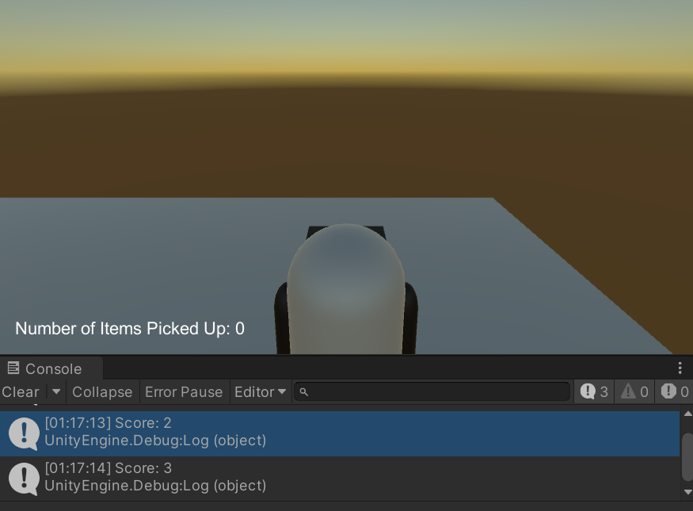
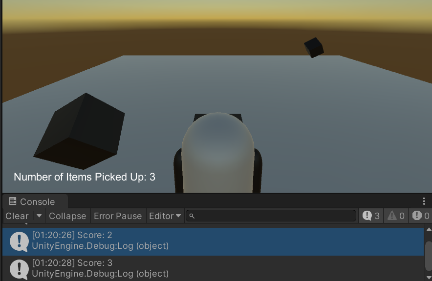

# Picking Up Items

## Tasks
1. Open the scene `Task_2_6`. There is a Player Object on the scene which can move and items to pickup.
2. On the screen there is a text box `ItemsPickedUpText` that should be updated when an item is picked up. This is the player's score.
3. Edit the script `Task_2_6_PickingUpItems` so that when the player activate the trigger on a pickup the score updates.
4. The pickup objects have the tag `Pickup` applied to them.
5. Initially print the score using Debug.Log

## Reference Images

