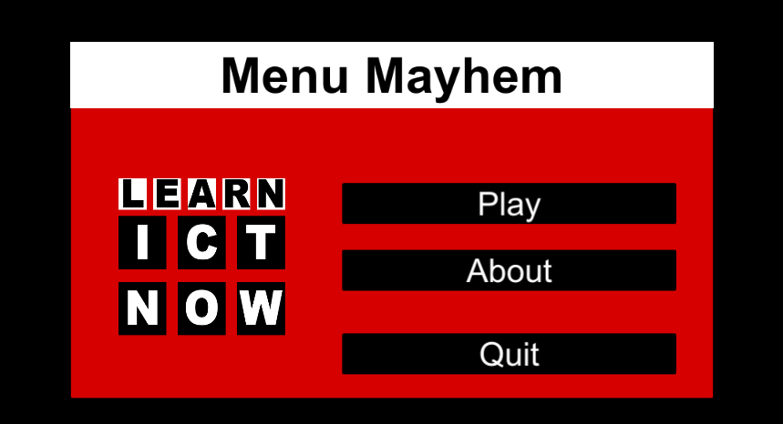
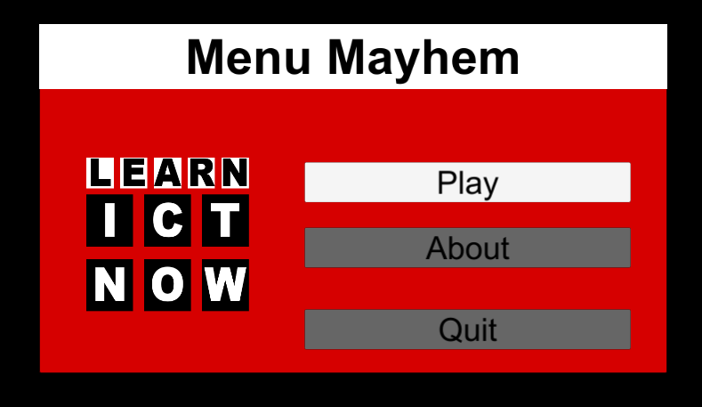
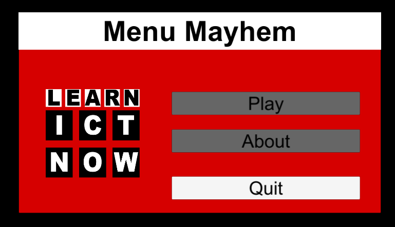
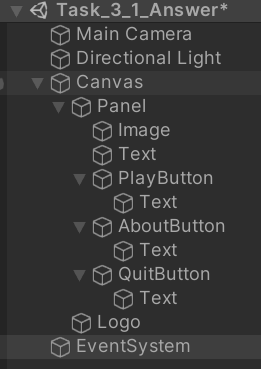

# Creating a Menu

This task involves creating a menu layout. It doesn't involve coding and scripting the buttons.

## Tasks
1. Create a new `Scene`
2. Create a menu that looks similar to the one below:

3. Note the panel background should not fill the screen. The example has one that is 80% of the screen.
4. Make sure that the canvas resizes appropriatelywith the screen resolution.
5. The resolution should be set to 1920 x 1080. i.e. HD.
6. Add a title section
7. Add three buttons.
8. Set the `Play button` to be first selected by default.
9. Use the reference images to help you.
10. Use your own image (copyright free and no memes) on the UI.
11. You should set out the layout and colour scheme to one of your choice.
12. The buttons do not have to work.

## Reference Images

