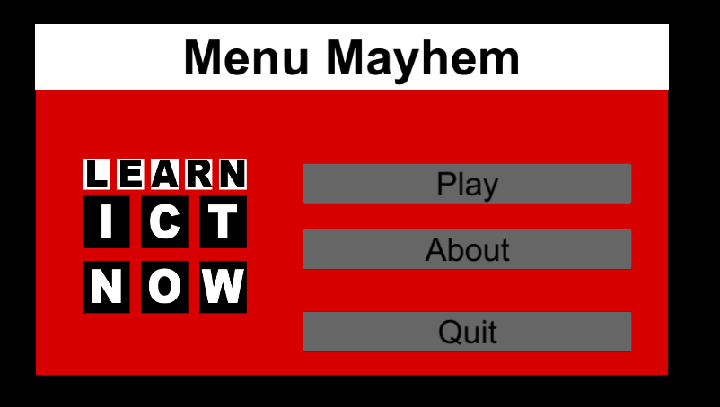

# Linking Buttons Between Scenes

This task involves adding actions to buttons. There are two scenes provided `Task_3_2_Main` which contains the main menu and `Task_3_2_Game` which contains a game scene that plays a scene for five seconds before returning to the menu.

## Tasks
1. Open the scene `Task_3_2_Main`.
2. Add code so that when the `Play` button is clicked the `Task_3_2_Game` scene will load.
3. Create a new scene for the About button and place about information on the scene. Alternatively (and preferably) add a second Canvas to the `Task_3_2_Main` scene and turn on this canvas when the about button is clicked.
4. The About scene or canvas should have your details and a back button which will take you back to the main scene.
5. The quit button should exit the application. Note you will have to make a build to test this.

## Reference Images

