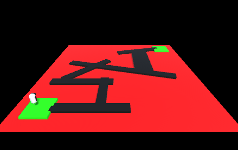
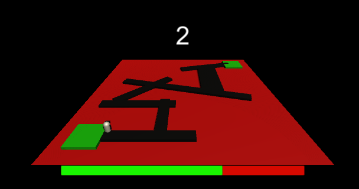

# Player UI

## Tasks
1. Open the scene `Task_3_4`. The player will move and respawn when they contact the red lava.
2. A player should be given three lives when the game starts / scene loads.
3. Create a UI that will display the number of lives a player has left.
4. If the player loses all of their lives the game should reset.
5. There should be a timer that counts down from 10 seconds.
6. When the timer reaches zero the game should reset.
7. **Extension**: Add item pickups that will give the user extra lives or extra time.

## Reference Images

