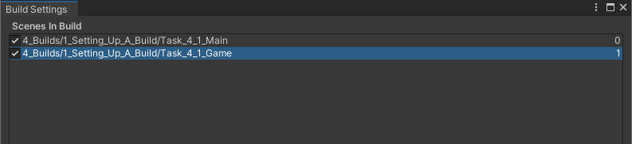
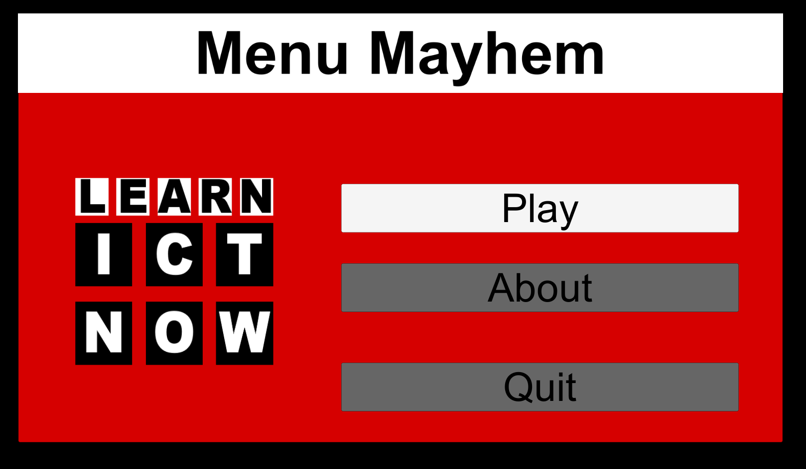

# Creating a Build

## Tasks
1. Add the scenes `Task_4_1_Main` and `Task_4_2_Game` to the Build Settings
2. Set the build as a Windows build.
3. Give the project a suitable title and details.
4. Build the project.
5. Test the build by running it.

## Reference Images

