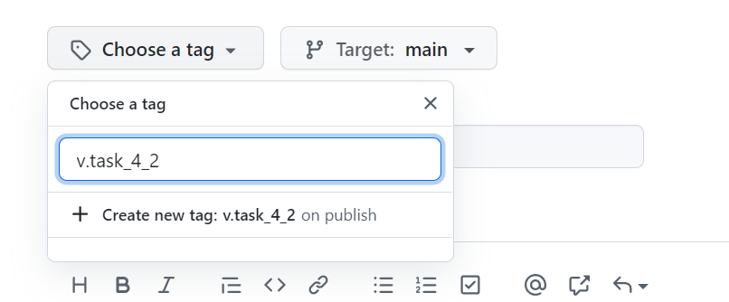
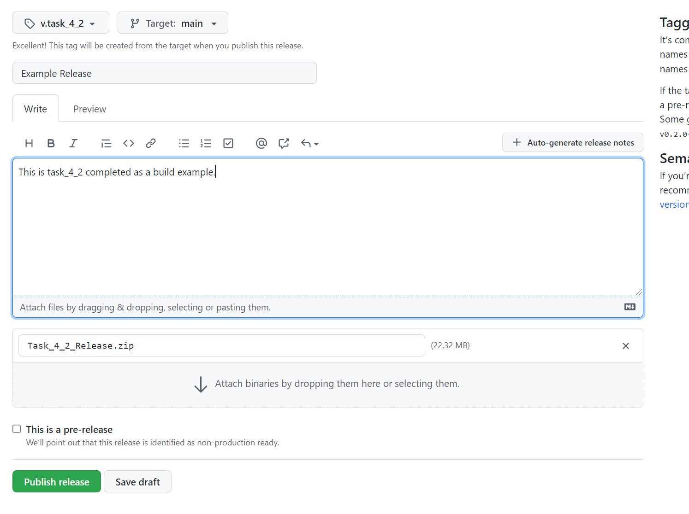
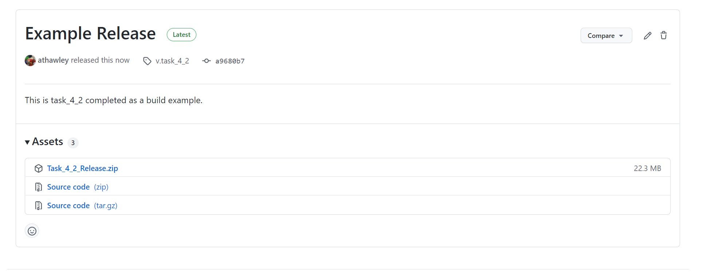
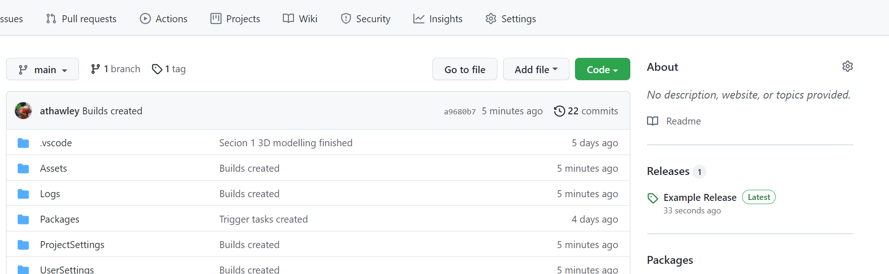

# Adding a release to Github

## Tasks
1. Use the build from `Task_4_1`.
2. Compress the Build into a zip file.
3. On [Github](http://www.github.com) create a new release for your repository.
4. Create a tag with the appropriate version number.
5. Complete the details for your release.
6. Upload the zip or binary files to the appropriate section.
7. Publish the release.

## Reference Images

